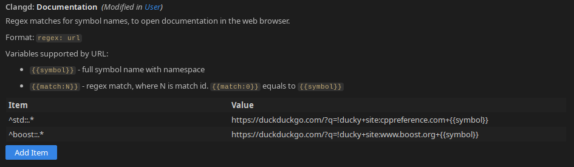

# Open symbol documentation for clangd

This extension extends clangd to provide a way to open the documentation of symbols under cursor.

Default hotkey is `Shift+F1`


By default extension opens only STL and Boost documentations.



**Example.** Open cppreference for compatible EASTL objects:

````json
{
    "clangd.documentation": {
    	"^eastl::(?!fixed_|intrusive_|slist|ring_buffer|vector_|linked_(?:ptr|array)|safe_ptr|(?:shared|scoped)_array|uninitialized_)(.*)": "https://duckduckgo.com/?q=!ducky+site:cppreference.com+std::{{match:1}}"
    }
}
````


**This extension required clangd with merged PR [#575](https://github.com/clangd/vscode-clangd/pull/575)** (clangd 0.1.29 or newer)